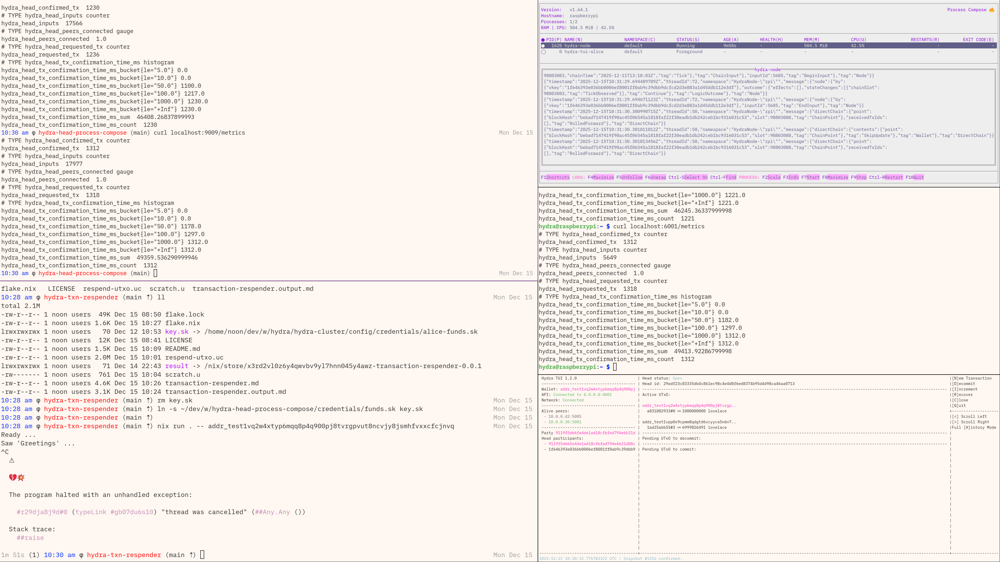

# hydra-blockfrost-rpi-demo

This is a small process-compose based Nix project configures:

1. A hydra-node,
2. The hydra-tui.

The peers are expected to be provided in the `./peers` folder in the following
way:

```shell
> tree peers
peers
├── noon
│   ├── cardano.vk
│   ├── hydra.vk
│   └── peer
└── protocol-parameters.json
```

Your credentials are expected to be provided in `../credentials`:

- `fuel.sk` - to pay for L1 transactions
- `funds.sk` - to bring L1 funds into the Head
- `hydra.sk` - to sign hydra transactions


### Configuration

You will also want to configure these values in `demo.nix`:

```
...
publicIp = "10.0.0.30";
hydraPort = "5001";
peers = [ "noon" ]; # List of peers you wish to connect to from your "./peers" folder
...
```

And, finally, you of course need a blockfrost project key in a file named
`blockfrost-project.txt`.


### Running

```
nix run .#rpi -- --theme "Catppuccin Latte"
```

### Trivia

This project is expected to be run with a companion hydra-node somewhere else.
For this purpose you may enjoy
[cardano-scaling/hydra-head-process-compose](https://github.com/cardano-scaling/hydra-head-process-compose)
which defines a process-compose-based hydra-node setup through but this time
using the cardano-node.


### Screenshots





### Metrics

Using the
[hydra-transaction-respender](https://github.com/cardano-scaling/hydra-txn-respender)
utility, one can get a gauge on how fast transactions can be signed between
the two peers.

**Raspberry PI**

``` sh
hydra@raspberrypi:~ $ curl localhost:6001/metrics
# TYPE hydra_head_confirmed_tx counter
hydra_head_confirmed_tx  1312
# TYPE hydra_head_inputs counter
hydra_head_inputs  5649
# TYPE hydra_head_peers_connected gauge
hydra_head_peers_connected  1.0
# TYPE hydra_head_requested_tx counter
hydra_head_requested_tx  1318
# TYPE hydra_head_tx_confirmation_time_ms histogram
hydra_head_tx_confirmation_time_ms_bucket{le="5.0"} 0.0
hydra_head_tx_confirmation_time_ms_bucket{le="10.0"} 0.0
hydra_head_tx_confirmation_time_ms_bucket{le="50.0"} 1182.0
hydra_head_tx_confirmation_time_ms_bucket{le="100.0"} 1297.0
hydra_head_tx_confirmation_time_ms_bucket{le="1000.0"} 1312.0
hydra_head_tx_confirmation_time_ms_bucket{le="+Inf"} 1312.0
hydra_head_tx_confirmation_time_ms_sum  49413.92286799998
hydra_head_tx_confirmation_time_ms_count  1312
```

**Local computer**

This is the computer that was actually constructing and sending the `NewTx`'s.

``` sh
> curl localhost:9009/metrics
# TYPE hydra_head_confirmed_tx counter
hydra_head_confirmed_tx  1312
# TYPE hydra_head_inputs counter
hydra_head_inputs  17977
# TYPE hydra_head_peers_connected gauge
hydra_head_peers_connected  1.0
# TYPE hydra_head_requested_tx counter
hydra_head_requested_tx  1318
# TYPE hydra_head_tx_confirmation_time_ms histogram
hydra_head_tx_confirmation_time_ms_bucket{le="5.0"} 0.0
hydra_head_tx_confirmation_time_ms_bucket{le="10.0"} 0.0
hydra_head_tx_confirmation_time_ms_bucket{le="50.0"} 1178.0
hydra_head_tx_confirmation_time_ms_bucket{le="100.0"} 1297.0
hydra_head_tx_confirmation_time_ms_bucket{le="1000.0"} 1312.0
hydra_head_tx_confirmation_time_ms_bucket{le="+Inf"} 1312.0
hydra_head_tx_confirmation_time_ms_sum  49359.536290999946
hydra_head_tx_confirmation_time_ms_count  1312
```
